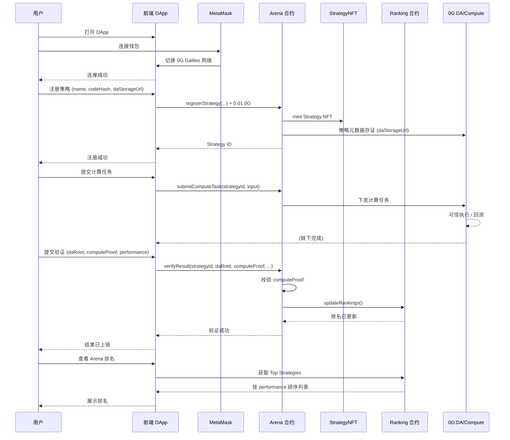

# Verifiable AI Trading Arena

**0G 黑客松 MVP** — 可验证的 AI 交易竞技场 · 让 AI 交易从概率变成科学

---

## 项目介绍

### 核心价值

将 AI 交易策略从「黑箱」转变为**可验证科学**，实现数据、执行、结果的全流程透明与可验证。

**口号**: *"0G turns AI trading from belief into verifiable science."*

### 核心优势

| 传统 AI 交易 | Verifiable AI Trading Arena |
|-------------|----------------------------|
| 策略是 PPT，难以复现 | 策略是代码，链上可验证 |
| 收益是截图，无法核验 | 收益链上可查、可审计 |
| 决策过程不可见 | 决策过程可被任何人验证 |
| 依赖信任 | 具备科研级可复现性 |

### 与 0G 的契合点

1. **0G DA**：策略代码、元数据、计算日志统一存储在 DA，链上哈希可验证  
2. **0G Compute**：AI 推理/回测在 Compute 层可信执行（MVP 已预留接口）  
3. **0G Chain**：合约部署于 Galileo 测试网，费用低、确认快  

### 创新点与亮点

- **可验证性**：策略代码哈希与 DA 地址链上存储，任何人可验证真实性  
- **透明性**：策略与收益公开，决策过程可审计  
- **0G 生态**：部署于 Galileo，为 DA/Compute 集成做好准备  
- **科研级复现**：将 AI 交易从「信念」升级为可验证、可复现的科学实验  

---

## 项目概览

彻底破解 AI 交易策略黑箱问题，实现**数据、执行、结果**的全流程透明与可验证。策略不是 PPT，收益不是截图，决策过程可被任何人验证。


---

## 系统架构

整体采用**链上合约 + 前端 DApp + 0G DA/Compute** 三层结构：策略注册与结算在链上，数据与计算证明通过 0G 存证与验质。

| 层级 | 组件 | 说明 |
|------|------|------|
| **合约层** | StrategyNFT / Arena / Ranking | 策略 INFT 注册、性能验证、排名结算 |
| **前端层** | React + Vite + ethers.js | 钱包连接、注册/提交/验证、排名展示 |
| **0G 层** | DA 存证、Compute 验质 | 策略/结果存证；result_hash 校验（可扩展 TEE/ZK） |


---

## 项目流程

1. **连接钱包** → MetaMask 连接并切换到 0G Galileo 网络  
2. **注册策略** → 支付 0.01 0G，将策略元数据（含 `daStorageUrl`）登记为 INFT  
3. **提交计算任务** → 在策略详情中发起计算任务，对应 0G Compute 侧执行  
4. **验证结果** → 提交 `daRoot`、`computeProof`、性能数据，合约校验后更新性能与排名  
5. **查看排名** → Arena 页按可验证的 performance 自动排序展示  

### 项目流程图（时序图）




---

## 界面与演示


---

## 演示版本（可直接运行）

```bash
cd frontend
npm install
npm run dev
```

访问 **http://localhost:5173**，连接 MetaMask 并切换到 0G Galileo 网络即可演示。

**合约已部署** 0G Galileo 测试网，`frontend/.env.local` 已配置。

---

## MVP 部署信息

- **合约**：0G Galileo (CHAIN_ID: 16602)，见 [contract/deployment-addresses.txt](contract/deployment-addresses.txt)
- **前端**：本地 `npm run dev` 或 `npm run preview`（生产构建后）
- **水龙头**：https://faucet.0g.ai/

---

## 技术栈

- **智能合约**: Foundry + Solidity ^0.8.20
- **前端**: React 18 + Vite + ethers.js 5
- **网络**: 0G Galileo Testnet (CHAIN_ID: 16602)

---

## 快速开始

### 1. 部署合约

```bash
# 配置项目根目录 .env (PRIVATE_KEY, RPC_URL)
cd contract
npm install
forge build
forge script script/Deploy.s.sol:DeployScript \
  --rpc-url $env:RPC_URL \
  --private-key $env:PRIVATE_KEY \
  --broadcast -vvvv
```

或使用脚本（从项目根目录）：
```powershell
.\scripts\deploy.ps1
```

### 2. 配置前端

若重新部署合约，从项目根目录运行 `scripts/post-deploy.ps1` 或手动更新 `frontend/.env.local`：

```env
VITE_ARENA_CONTRACT=0x1A6A709672Cd8469e3760C6d5B2d4d60f7871493
VITE_STRATEGY_NFT_CONTRACT=0x8d0999A40C55e173c0aDC6F87ccC280cD861cBd8
VITE_RANKING_CONTRACT=0xD6f9724f7B56053230beB769157c7f06d8f1A654
```

### 3. 启动前端

```bash
cd frontend
npm install
npm run dev
```

### 4. 核心功能演示路径

1. 连接钱包（MetaMask）
2. 自动切换到 0G Galileo 网络
3. 注册策略（0.01 0G）
4. 提交计算任务（策略详情中点击「提交计算任务」）
5. 验证结果（策略详情中填写 daRoot、computeProof、性能数据后提交）
6. 查看排名（Arena 页自动展示按 performance 排序的排名）

**获取测试 0G**：访问 [水龙头](https://faucet.0g.ai/) 获取测试代币。

---

## 项目结构

```
deai-dapp-v2/          # 父工程
├── contract/          # 合约子工程 (Foundry)
│   ├── src/           # Solidity 合约
│   │   ├── Arena.sol
│   │   ├── StrategyNFT.sol
│   │   ├── Ranking.sol
│   │   └── interfaces/
│   ├── script/        # 部署脚本
│   ├── test/          # Foundry 测试
│   ├── lib/           # 依赖 (forge-std, openzeppelin)
│   └── broadcast/     # 部署记录
├── frontend/          # 前端子工程 (React + Vite)
├── scripts/           # 部署脚本 (deploy.ps1, post-deploy.ps1)
├── img/               # 文档与演示图片
└── README.md
```

---

## 0G 生态结合点

- **DA 层存证**：策略代码/元数据通过 `daStorageUrl` 存证；`verifyResult` 的 `daRoot`、`computeProof` 对应 result_hash、logs_hash 存证点
- **Compute 验质**：当前 MVP 用 result_hash（computeProof）校验；后续可接入 0G Compute / TEE 可信执行
- **合约结算**：排名由合约 `Ranking.updateRankings` 自动更新，依据可验证的 performance 数据

---

## 水龙头

https://faucet.0g.ai/
