# Verifiable AI Trading Arena

**0G 黑客松 MVP** — 可验证的 AI 交易竞技场 · 让 AI 交易从概率变成科学

---

## 项目介绍

### 核心价值

将 AI 交易策略从「黑箱」转变为**可验证科学**，实现数据、执行、结果的全流程透明与可验证。

**口号**: *"0G turns AI trading from belief into verifiable science."*

### 核心优势

| 传统 AI 交易 | Verifiable AI Trading Arena |
|-------------|----------------------------|
| 策略是 PPT，难以复现 | 策略是代码，链上可验证 |
| 收益是截图，无法核验 | 收益链上可查、可审计 |
| 决策过程不可见 | 决策过程可被任何人验证 |
| 依赖信任 | 具备科研级可复现性 |

### 与 0G 的契合点

1. **0G DA**：策略代码、元数据、计算日志统一存储在 DA，链上哈希可验证  
2. **0G Compute**：AI 推理/回测在 Compute 层可信执行（MVP 已预留接口）  
3. **0G Chain**：合约部署于 Galileo 测试网，费用低、确认快  

### 创新点与亮点

- **可验证性**：策略代码哈希与 DA 地址链上存储，任何人可验证真实性  
- **透明性**：策略与收益公开，决策过程可审计  
- **0G 生态**：部署于 Galileo，为 DA/Compute 集成做好准备  
- **科研级复现**：将 AI 交易从「信念」升级为可验证、可复现的科学实验  

---

## 项目概览

彻底破解 AI 交易策略黑箱问题，实现**数据、执行、结果**的全流程透明与可验证。策略不是 PPT，收益不是截图，决策过程可被任何人验证。

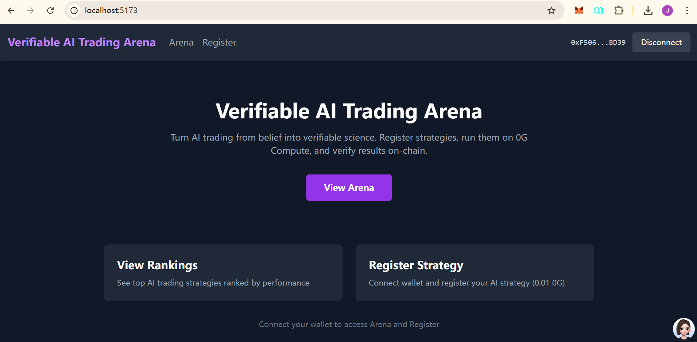

---

## 系统架构

整体采用**链上合约 + 前端 DApp + 0G DA/Compute** 三层结构：策略注册与结算在链上，数据与计算证明通过 0G 存证与验质。

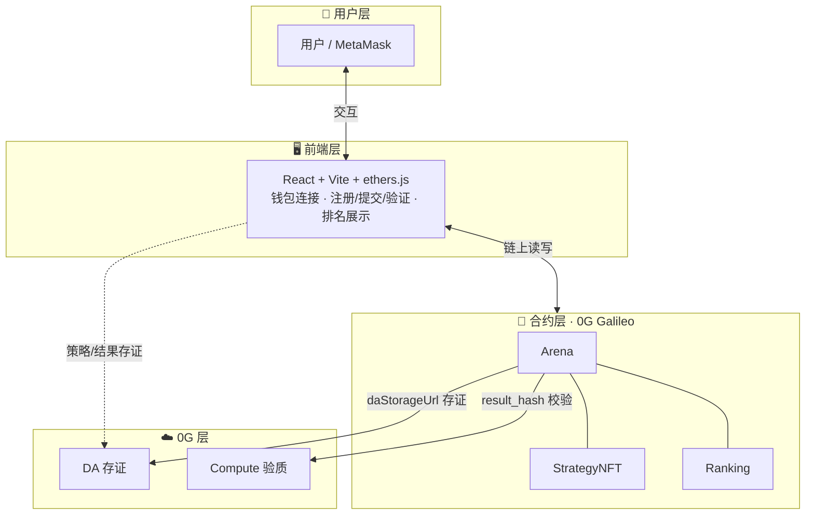

| 层级 | 组件 | 说明 |
|------|------|------|
| **合约层** | StrategyNFT / Arena / Ranking | 策略 INFT 注册、性能验证、排名结算 |
| **前端层** | React + Vite + ethers.js | 钱包连接、注册/提交/验证、排名展示 |
| **0G 层** | DA 存证、Compute 验质 | 策略/结果存证；result_hash 校验（可扩展 TEE/ZK） |


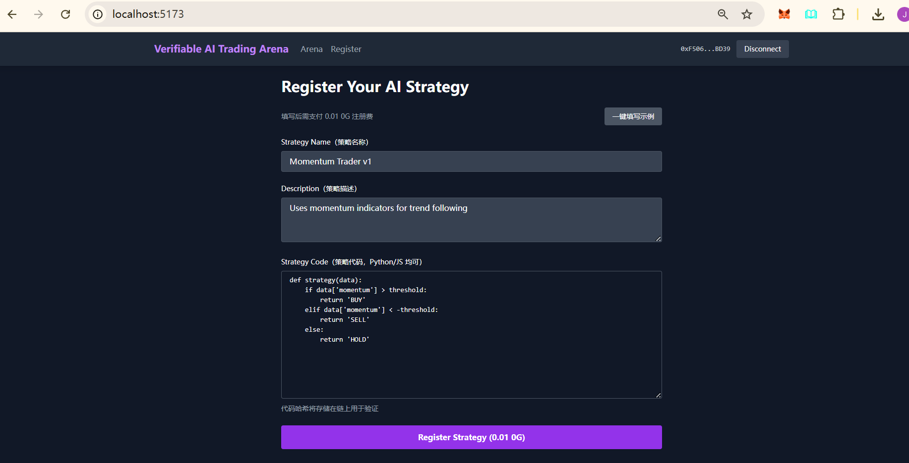

---

## 项目流程

1. **连接钱包** → MetaMask 连接并切换到 0G Galileo 网络  
2. **注册策略** → 支付 0.01 0G，将策略元数据（含 `daStorageUrl`）登记为 INFT  
3. **提交计算任务** → 在策略详情中发起计算任务，对应 0G Compute 侧执行  
4. **验证结果** → 提交 `daRoot`、`computeProof`、性能数据，合约校验后更新性能与排名  
5. **查看排名** → Arena 页按可验证的 performance 自动排序展示  

### 项目流程图（时序图）

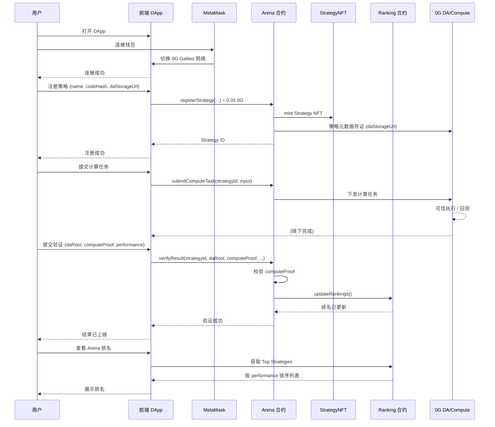

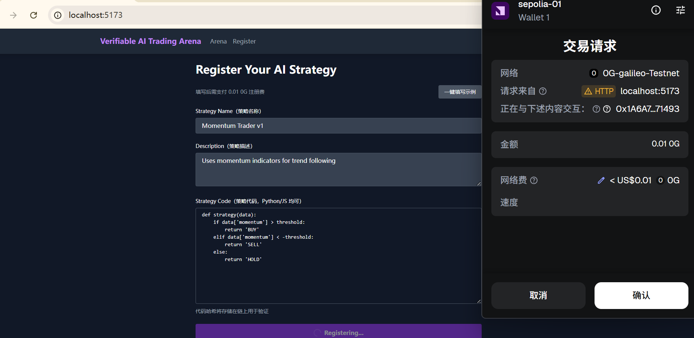

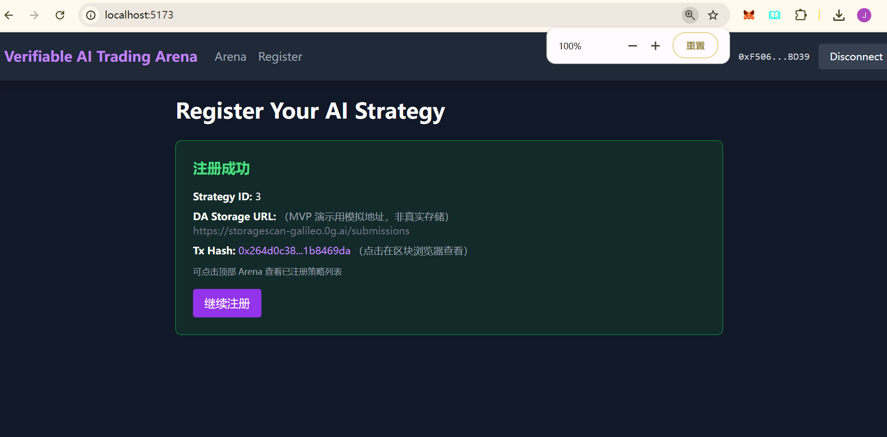

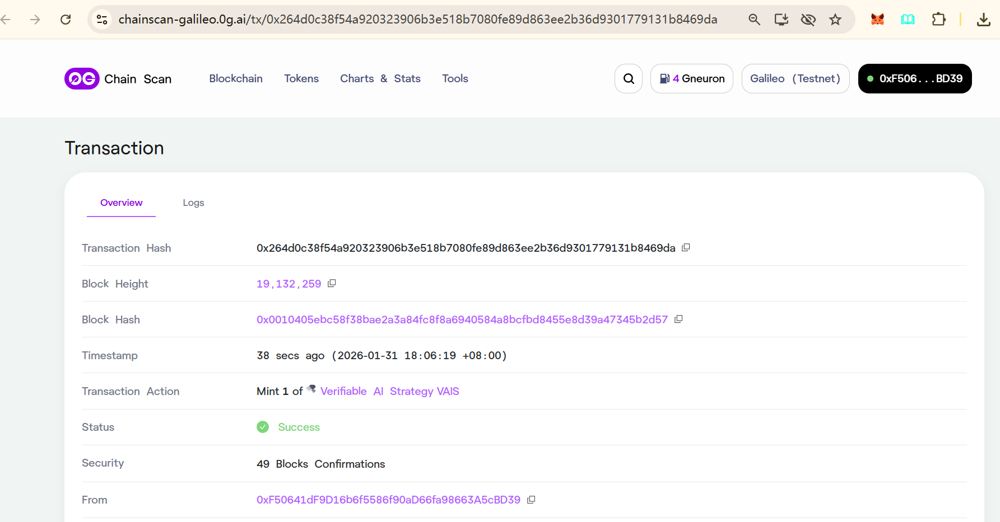

---

## 界面与演示

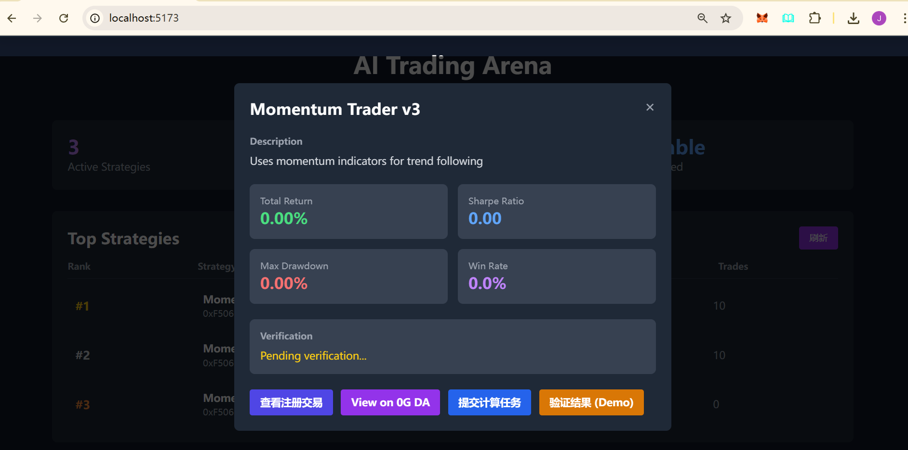

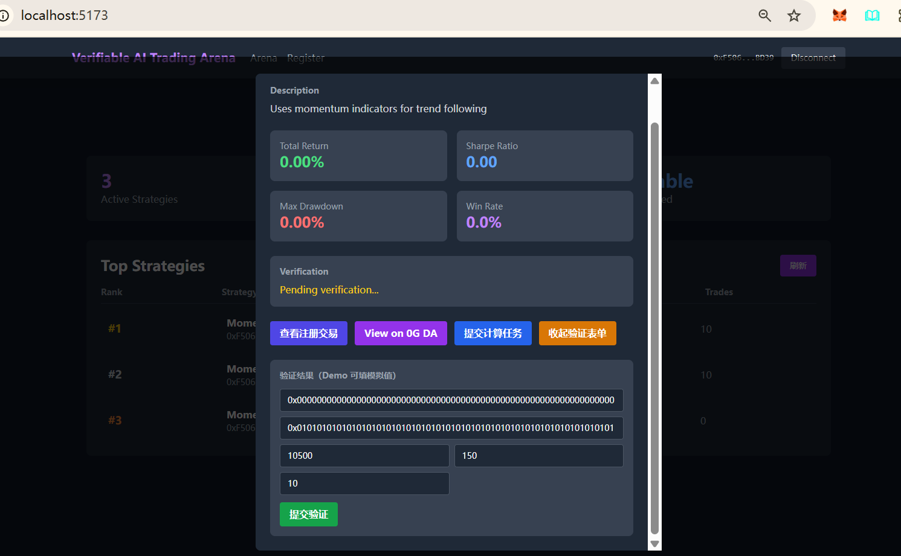

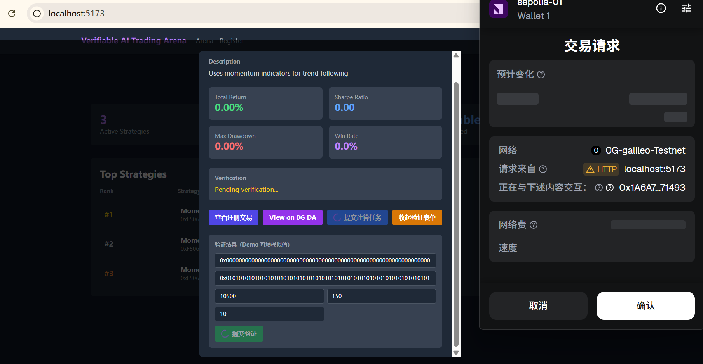

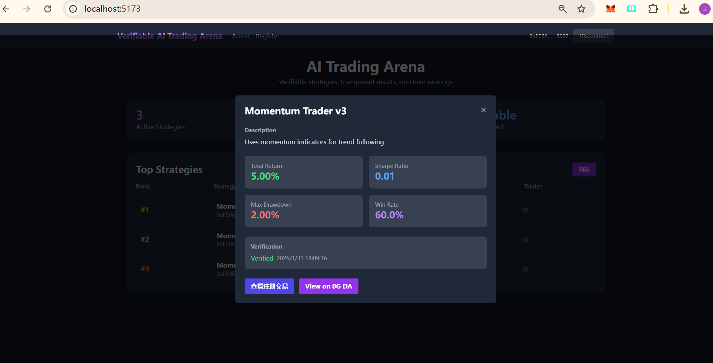

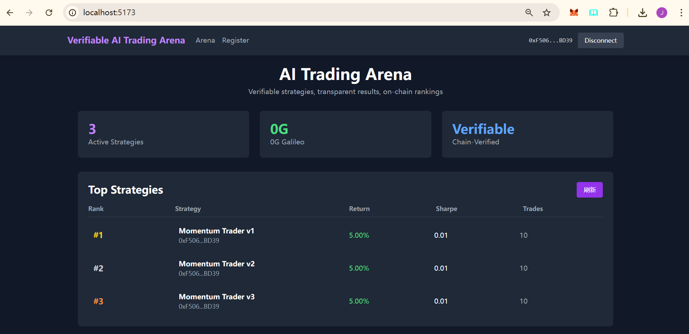

---

## 环境要求

- **Node.js** >= 18
- **npm** >= 9
- **Foundry**（仅部署/开发合约时需要）：[安装指南](https://book.getfoundry.sh/getting-started/installation)
- **MetaMask**（浏览器钱包）

---

## 本地快速运行

Git 克隆项目后，按以下步骤在本地运行。

### 步骤 1：克隆与初始化

```bash
git clone <repository-url>
cd deai-dapp-v2

# 初始化子模块（contract/lib 依赖）
git submodule update --init --recursive
```

### 步骤 2：选择运行场景

#### 场景 A：仅运行前端（使用已部署合约）

适用于快速体验，无需部署合约。合约已部署在 0G Galileo 测试网。

1. **配置前端环境变量**

   ```bash
   cd frontend
   cp .env.example .env.local
   ```

   编辑 `frontend/.env.local`，填入合约地址（可直接使用以下默认值）：

   ```env
   VITE_0G_CHAIN_ID=16602
   VITE_0G_RPC_URL=https://evmrpc-testnet.0g.ai

   VITE_ARENA_CONTRACT=0x1A6A709672Cd8469e3760C6d5B2d4d60f7871493
   VITE_STRATEGY_NFT_CONTRACT=0x8d0999A40C55e173c0aDC6F87ccC280cD861cBd8
   VITE_RANKING_CONTRACT=0xD6f9724f7B56053230beB769157c7f06d8f1A654
   ```

2. **安装依赖并启动**

   ```bash
   npm install
   npm run dev
   ```

3. 访问 **http://localhost:5173**，连接 MetaMask 并切换到 0G Galileo 网络。

---

#### 场景 B：完整流程（含合约部署）

适用于需要重新部署合约或本地开发。

1. **配置根目录 .env（合约部署用）**

   ```bash
   # 在项目根目录
   cp .env.example .env
   ```

   编辑 `.env`，填写：

   ```env
   PRIVATE_KEY=你的部署钱包私钥
   RPC_URL=https://evmrpc-testnet.0g.ai
   ```

   > ⚠️ `.env` 含敏感信息，已加入 .gitignore，请勿提交。

2. **部署合约**

   **Windows (PowerShell)：**
   ```powershell
   .\scripts\deploy.ps1
   ```

   **Linux / macOS：**
   ```bash
   cd contract
   npm install
   forge build
   forge script script/Deploy.s.sol:DeployScript \
     --rpc-url $RPC_URL \
     --private-key $PRIVATE_KEY \
     --broadcast -vvvv
   ```
   > 需先在根目录配置 `.env` 并 `source .env` 或 `export $(cat .env | xargs)` 导出变量。

3. **同步合约地址到前端**

   **Windows (PowerShell)：**
   ```powershell
   .\scripts\post-deploy.ps1
   ```
   脚本会自动从 `contract/broadcast/` 解析地址并生成 `frontend/.env.local`。

   **Linux / macOS** 或手动方式：从 `contract/deployment-addresses.txt` 或 `contract/broadcast/Deploy.s.sol/16602/run-latest.json` 获取地址，编辑 `frontend/.env.local`：

   ```env
   VITE_ARENA_CONTRACT=<Arena 地址>
   VITE_STRATEGY_NFT_CONTRACT=<StrategyNFT 地址>
   VITE_RANKING_CONTRACT=<Ranking 地址>
   ```

4. **启动前端**

   ```bash
   cd frontend
   npm install
   npm run dev
   ```

---

### 步骤 3：核心功能演示路径

1. 连接钱包（MetaMask）
2. 自动切换到 0G Galileo 网络
3. 注册策略（0.01 0G）
4. 提交计算任务（策略详情中点击「提交计算任务」）
5. 验证结果（策略详情中填写 daRoot、computeProof、性能数据后提交）
6. 查看排名（Arena 页按 performance 排序）

**获取测试 0G**：访问 [水龙头](https://faucet.0g.ai/) 获取测试代币。

---

### 配置说明汇总

| 配置文件 | 用途 | 何时需要 |
|----------|------|----------|
| **根目录 `.env`** | 合约部署（PRIVATE_KEY、RPC_URL） | 仅当需要部署/重部署合约时 |
| **`frontend/.env.local`** | 前端连接合约（合约地址、链配置） | 始终需要；重部署后需更新 |

**重要**：每次重新部署合约后，必须更新前端配置（运行 `.\scripts\post-deploy.ps1` 或手动修改 `frontend/.env.local`），否则前端仍会连接旧合约。

---

### 常见问题

| 问题 | 处理方式 |
|------|----------|
| 子模块为空 / `lib` 目录缺失 | 运行 `git submodule update --init --recursive` |
| 前端无法连接合约 | 检查 `frontend/.env.local` 中三个合约地址是否已填写 |
| 部署后前端仍连旧合约 | 运行 `.\scripts\post-deploy.ps1` 或手动更新 `frontend/.env.local` |
| 合约部署失败 | 确认根目录 `.env` 中 `PRIVATE_KEY`、`RPC_URL` 正确，钱包有足够 0G（[水龙头](https://faucet.0g.ai/)） |

---

## MVP 部署信息

- **合约**：0G Galileo (CHAIN_ID: 16602)，见 [contract/deployment-addresses.txt](contract/deployment-addresses.txt)
- **前端**：本地 `npm run dev` 或 `npm run preview`（生产构建后）
- **水龙头**：https://faucet.0g.ai/

---

## 技术栈

- **智能合约**: Foundry + Solidity ^0.8.20
- **前端**: React 18 + Vite + ethers.js 5
- **网络**: 0G Galileo Testnet (CHAIN_ID: 16602)

---

## 项目结构

```
deai-dapp-v2/          # 父工程
├── contract/          # 合约子工程 (Foundry)
│   ├── src/           # Solidity 合约
│   │   ├── Arena.sol
│   │   ├── StrategyNFT.sol
│   │   ├── Ranking.sol
│   │   └── interfaces/
│   ├── script/        # 部署脚本
│   ├── test/          # Foundry 测试
│   ├── lib/           # 依赖 (forge-std, openzeppelin)
│   └── broadcast/     # 部署记录
├── frontend/          # 前端子工程 (React + Vite)
├── scripts/           # 部署脚本 (deploy.ps1, post-deploy.ps1)
├── img/               # 文档与演示图片
└── README.md
```

---

## 0G 生态结合点

- **DA 层存证**：策略代码/元数据通过 `daStorageUrl` 存证；`verifyResult` 的 `daRoot`、`computeProof` 对应 result_hash、logs_hash 存证点
- **Compute 验质**：当前 MVP 用 result_hash（computeProof）校验；后续可接入 0G Compute / TEE 可信执行
- **合约结算**：排名由合约 `Ranking.updateRankings` 自动更新，依据可验证的 performance 数据

---

## 水龙头

https://faucet.0g.ai/
